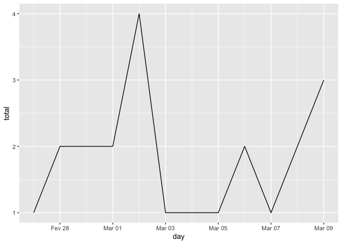
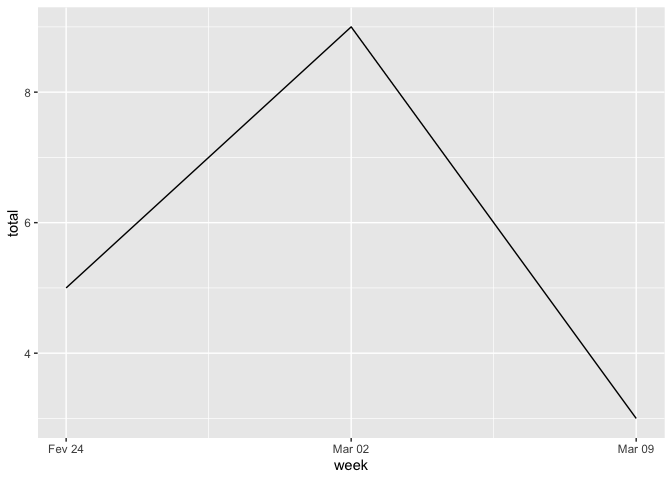
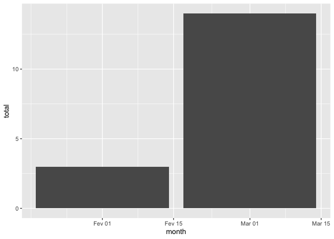

Dicas R
================
Marcos Abreu
7/17/2020

## Dicas R

### 2020-07-18 Apresentar os dados no tempo, sumarizados por dia, semana e ano.

``` r
require(lubridate)
require(dplyr)
require(ggplot2)
x <- data.frame(
  solicitação = c(1234, 1235, 1236, 1237, 1238, 1239, 1240, 1241, 1242, 1243, 1244, 1245, 1246, 1247, 1248, 1249, 1250),
  data = c("2020-02-27", "2020-02-28", "2020-02-28", "2020-03-01", "2020-03-01", "2020-03-02", "2020-03-02", "2020-03-02", "2020-03-02", "2020-03-03", "2020-03-05", "2020-03-06", "2020-03-06", "2020-03-07", "2020-03-09", "2020-03-09", "2020-03-09"))
# summarize by day
# each day has the respective start of week and start of month
x_by_periode <- x %>% select(data) %>%
  mutate(data = ymd(data)) %>% 
  group_by(day = date(data)) %>% 
  summarise(total = n()) %>% 
  mutate(week = as.Date(cut(day, "week")), # by default weeks start on monday
         month = as.Date(cut(day, "month")))

ggplot(x_by_periode, aes(x = day, y = total)) +
  geom_line() 
```

<!-- -->

``` r
ggplot(x_by_periode, aes(x = week, y = total)) +
  stat_summary(fun = sum, geom = 'line')
```

<!-- -->

``` r
ggplot(x_by_periode, aes(x = month, y = total)) +
  stat_summary(fun = sum, geom = 'bar')
```

<!-- -->

### 2020-07-17 Como gerar um RMarkdown que é publicado como github pages:

*R.:* O parâmetro *output* do seu yaml header deve ser
\*rmarkdown::github\_documento".

*Exemplo:*

    ---
    title: "Dicas R"
    author: "Marcos Abreu"
    date: "7/17/2020"
    output: rmarkdown::github_document
    ---

### 2020-07-17 Dado um vetor contendo frases, criar um data frame com coluna contendo o número de palavras de cada frase.

``` r
(frases <- c("Olá", "Bom dia", "Volto logo", "Acabou de chegar"))
```

    ## [1] "Olá"              "Bom dia"          "Volto logo"       "Acabou de chegar"

``` r
require(stringr)
require(dplyr)
df <- data.frame(frases)

# função para contar número de palavras usando REGEX
count_words <- function(x) {str_count(x, "\\S+")}

(df <- df %>% 
  mutate(words = sapply(frases, count_words)) %>% 
  arrange(words)) # a ordenação é opcional
```

    ##             frases words
    ## 1              Olá     1
    ## 2          Bom dia     2
    ## 3       Volto logo     2
    ## 4 Acabou de chegar     3
